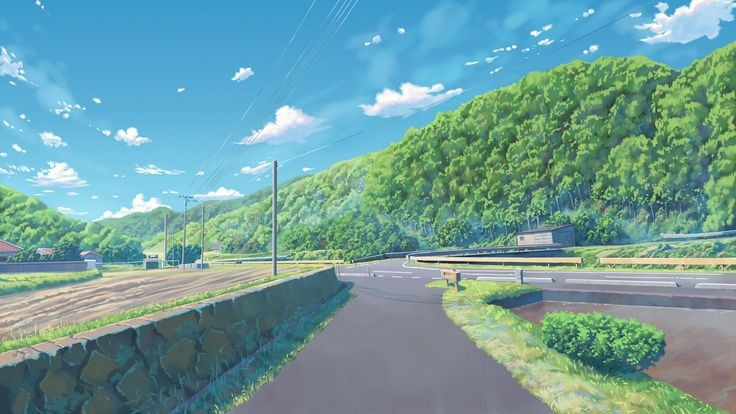

# 💫 About Me:
Students who are enthusiastic about computing with Node.js and Ruby skills. Experienced in web application and API development, and has a strong interest in continuous learning and innovation.

## 🌐 Socials:
 

# 💻 Tech Stack:
                       
# 📊 GitHub Stats:
 
 

### ✍️ Random Dev Quote

---

<!-- Proudly created with GPRM ( https://gprm.itsvg.in ) -->
